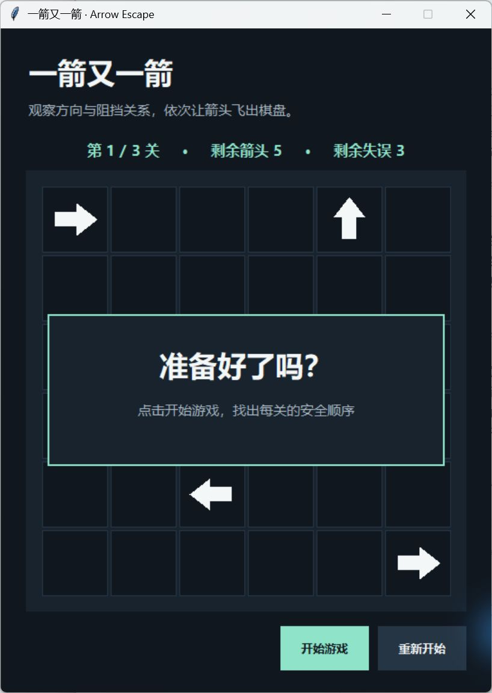
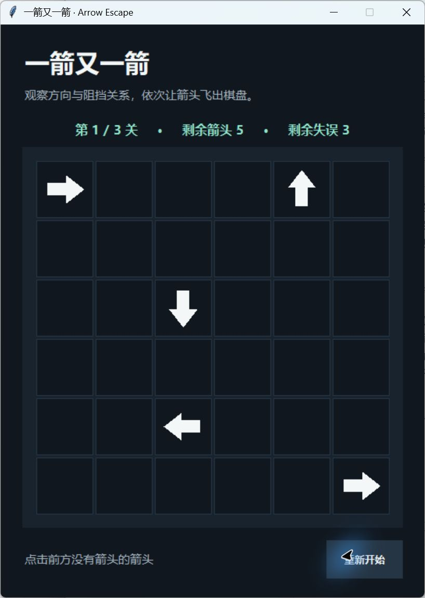
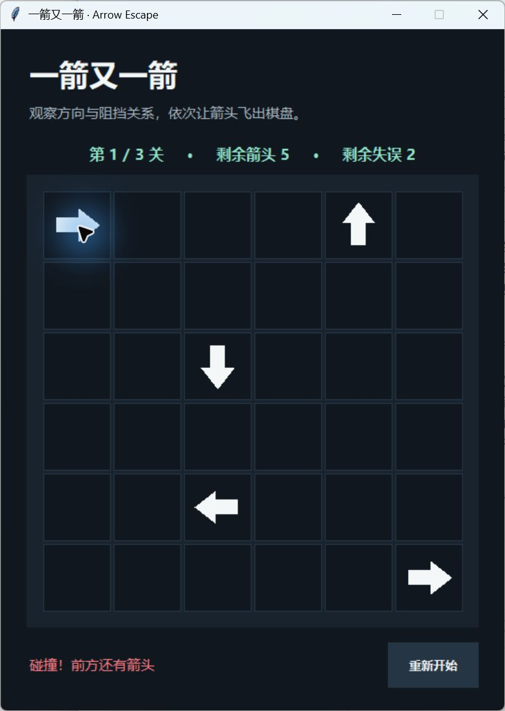
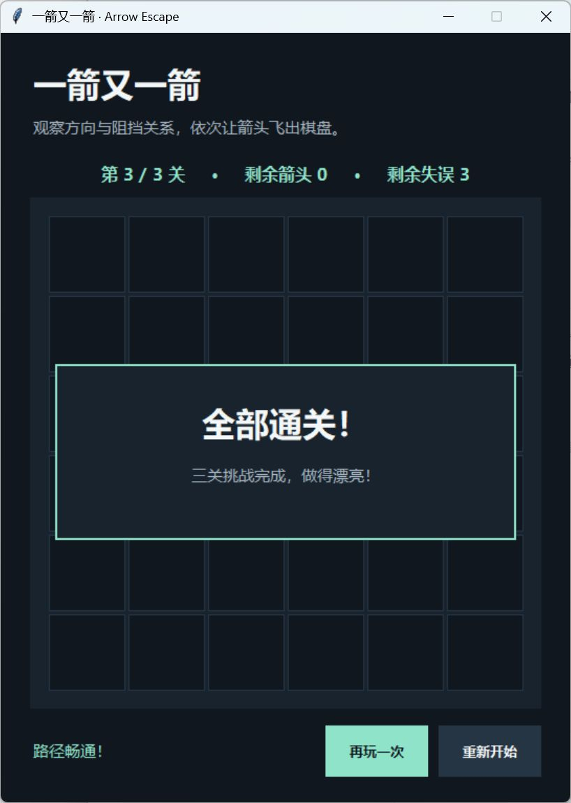

# 一箭又一箭

一个用 Python 标准库 Tkinter 制作的点击式箭头解谜游戏。点击箭头前，先观察它朝向的同一行或同一列：前方没有其他箭头就能飞出；有箭头挡路则发生碰撞，并扣除一次失误机会。

## 环境与运行

- Python 3.9 或更新版本，需带 Tkinter（Windows 官方 Python 通常自带）
- 不需要第三方包；无网络请求、无素材或 API Key

```powershell
python game.py
```

出现开始界面后点击“开始游戏”。鼠标点击箭头进行选择；“重新开始”会恢复当前关卡箭头和 3 次失误机会。过关后点击“下一关”；失败后点击“重试本关”。共 3 关。

## 玩法与实现

- `logic.py`：关卡数据、四方向路径判断、关卡求解验证。
- `game.py`：Tkinter 图形界面、鼠标交互、飞出和碰撞动画、关卡状态。
- `test_logic.py` / `test_game.py`：规则和 T01—T06 状态测试。

一个箭头用 `(行, 列, 方向)` 表示。`blocker()` 从该箭头相邻的下一格起，沿方向逐格扫描；遇到箭头返回阻挡者，先到棋盘边界则返回 `None`。`solution()` 用深度优先搜索验证每关都存在清除顺序。

## 测试

```powershell
python -m unittest -v
```

当前自动测试包含：无阻挡消除、受阻扣次数、边缘出界、清关切换、失误耗尽、重新开始、四方向覆盖与三关可解性。另已在真实窗口中从开始界面玩到第 3 关“全部通关”，结果截图见下方。

## 游戏截图

以下截图来自程序实际运行窗口：

- 
- 
- 
- 


## AIGC 记录

本项目由 Codex 协助分析、编码和测试。初版关卡中第 2、3 关出现互相阻挡；自动求解测试报错后已修改方向并重新验证。更多真实过程见配套博客草稿。
